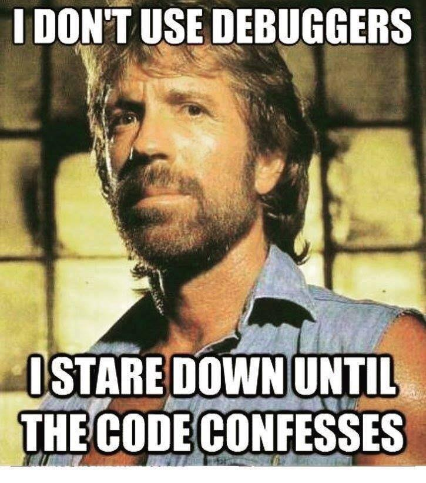

# Debugging tools
{ width=70% }

RStudio comes with a number of useful build in debugging tools.
You can use them in a interactive R session i.e. you can interact with your code while it is being executed.

### Interactive R session
- R session reacts to user input (usually the default)
- Check with `interactive()`

### Step through the code - `debug()`

- `debug(my_defunct_function)`  
- Will open debug mode whenever `my_defunct_function` is called  
- Call exported functions from a package with `packagename::`  
- Unexported functions can be referred to with `packagename:::`  
- Stop debugging `undebug(my_defunct_function)` or overwrite the function (e.g. by sourcing it).  
- `debugonce(my_defunct_function)` will go in browse mode the next time the function is called.  

{ width=70% }

### `browser()`
- Enter browser() anywhere in your code where you want the execution to halt. 
- You can then inspect the environment at that state.  
- You can also change objects and continue.  
- You can also use `browser()` as an error handler. 
- `Browse[number]` The number tells you at which level of the call stack you are.
- `options(error = recover)` automatically switches to browsing when an error occurs

<insert screenshot of browse menu and legend>

### Breakpoints
- Does the same as `browser()` but without littering your code. 
- Click left of a line number for a dot to appear.  
- Next time you run the code it will stop there.
- You can explore and change the current state.

### `traceback()`

- Shows you the last commands that have been called before the error occured (i.e. the stack).
- Helps locating the problem.
- Reverse order, latest command is on top.
- `rlang::last_trace()` is ordered in the opposite way to `traceback()`

