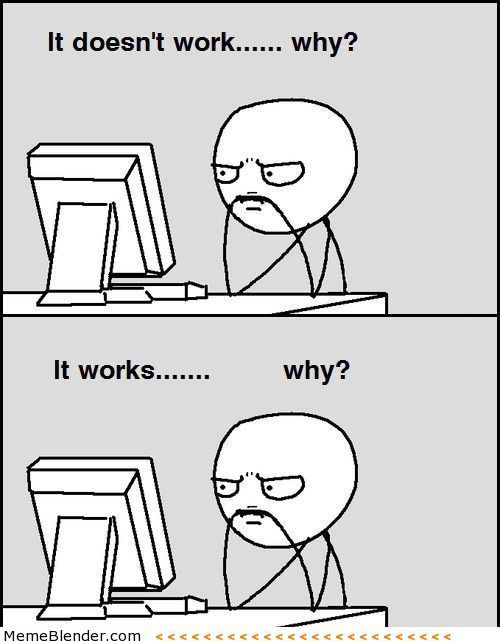

<!-- HTML comment -->
<!-- { width=70% } -->

# It works again?

- A cryptic stack overflow post fixed it?
- You made some random changes?

{ width=60% }

Take the time to figure out *why* these fixes work and try making a note what 
the solution was. Chances are you'll break it again or run into the 
same error later in your code.

